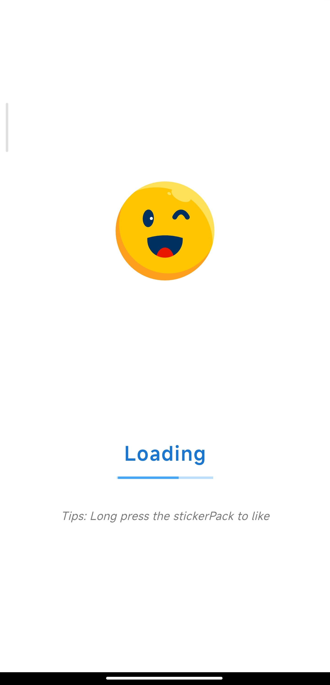
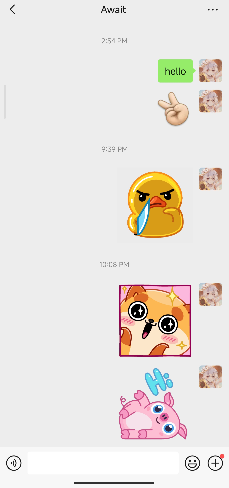

# Sticker Share

[](https://flutter.dev)
[](https://dart.dev)

[English](README.md) | `中文`

Sticker Share：管理和分享动画贴纸到各种消息平台。

<p align = "center">
  
  
  
</p>

## 说明

[Telegram Stickers Download](https://github.com/TecReaGroup/telgram_stickers_download)

目前只有安卓端测试过，以下为安卓端具体情况

| 应用 | 状态 | 说明 |
|-----|------|------|
| WeChat | 已测试 | send to 预览无法加载 |
| QQ | 已测试 | 完全支持 |
| Discord | 已测试 | 完全支持 |
| X | 已测试 | 完全支持 |
| Messenger | 已测试 | 完全支持 |
| Telegram | 已测试 | 会自动转成图片 |
| WhatsApp | 未测试 | 待测试 |
| LINE | 未测试 | 待测试 |

## 架构

### 项目结构

```
lib/
├── models/              # 数据模型
│   ├── sticker_model.dart
│   └── sticker_pack_model.dart
├── providers/           # 状态管理
│   └── sticker_provider.dart
├── screens/            # UI 界面
│   ├── home_screen.dart
│   └── splash_screen.dart
├── services/           # 业务逻辑
│   ├── database_service.dart
│   └── messaging_share_service.dart
└── main.dart           # 应用入口
```

## 快速开始

### 前置要求

- Flutter SDK: >= 3.9.2
- Dart SDK: >= 3.9.2
- Android Studio / VS Code 与 Flutter 扩展

### 安装

1. 克隆仓库:
```bash
git clone https://github.com/yourusername/sticker_share.git
cd sticker_share
```

2. 安装依赖:
```bash
flutter pub get
```

3. 运行应用:
```bash
flutter run
```

### 构建

#### Android
```bash
flutter build apk --release
```

#### iOS
```bash
flutter build ios --release
```

#### Windows
```bash
flutter build windows --release
```

## 使用方法

### 管理贴纸包

1. **浏览贴纸包**: 顶部可横向滚动的包选择器
2. **切换贴纸包**: 在主网格上左右滑动导航
3. **标记收藏**: 长按包名称切换收藏状态
4. **筛选收藏**: 点击心形图标仅显示收藏的包

### 分享贴纸

1. **点击贴纸**: 打开分享对话框
2. **选择应用**: 从已安装的消息应用中选择
3. **分享**: 以 GIF 格式分享

## 性能优化

关于本项目实现的 UI/UX 优化的详细信息，请参阅[性能文档](doc/PERFORMANCE.md)。

重点亮点:
- 后台 Lottie 预加载
- 滚动时智能动画暂停/恢复
- 优先级包加载
- 基于手势的导航
- 内存高效渲染
- 点击 sticker 后，最下面 listTile 只显示一半，以暗示滑动

## 开发

### 添加新的贴纸包

1. 在 `assets/stickers/[PackName]/` 中创建新文件夹
2. 将 Lottie JSON 文件添加到 `[PackName]/lottie/`
3. 将 GIF 文件添加到 `[PackName]/gif/`（与 Lottie 文件同名）
4. 应用会在下次启动时自动扫描并加载新包

### 数据库结构

**sticker_packs**
- id (TEXT): 唯一包标识符
- name (TEXT): 显示名称
- isFavorite (INTEGER): 收藏状态 (0/1)

**stickers**
- id (TEXT): 唯一贴纸标识符
- name (TEXT): 显示名称
- localPath (TEXT): Lottie JSON 资源路径
- gifPath (TEXT): GIF 资源路径
- packId (TEXT): 贴纸包外键

## TODO List
 - [ ] 本地导入 Stickers
 - [ ] 云端备份，下载
 - [ ] 多语言支持
 - [ ] 添加贴纸预览大图功能（长按查看）
 - [ ] 优化操作逻辑和 UI/UX 等，更好管理 Stickers
 - [ ] IOS 支持
 - [ ] 支持表情包编辑

## 许可证

本项目采用 MIT 许可证 - 详见 [LICENSE](LICENSE) 文件。

## 贡献

欢迎贡献！请随时提交 Pull Request。

